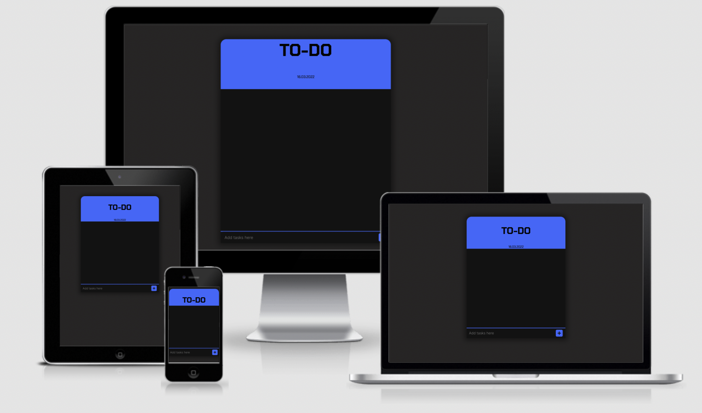
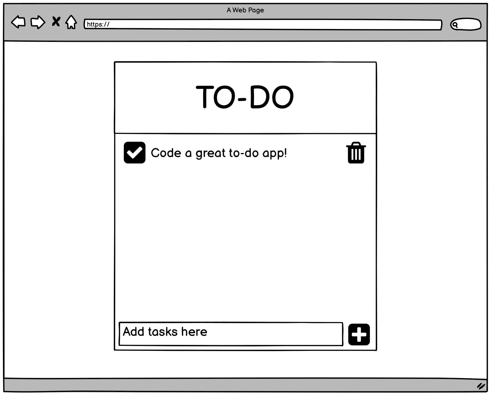
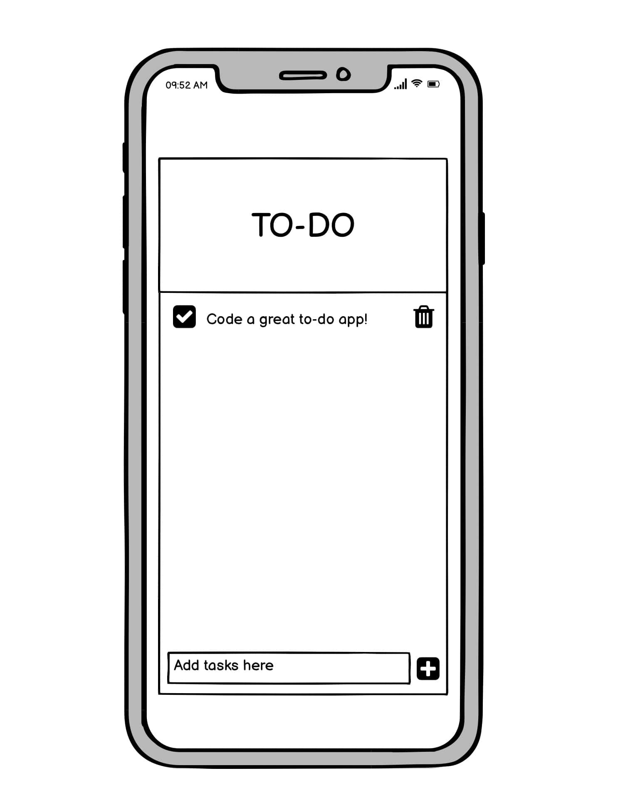
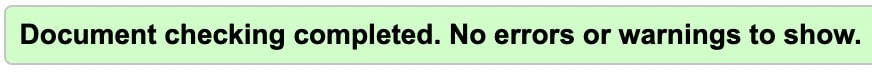
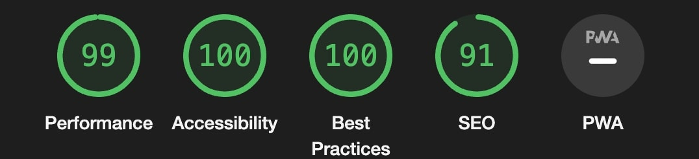
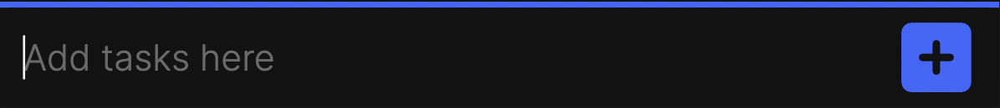
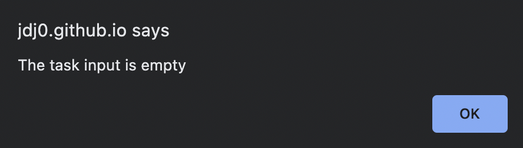
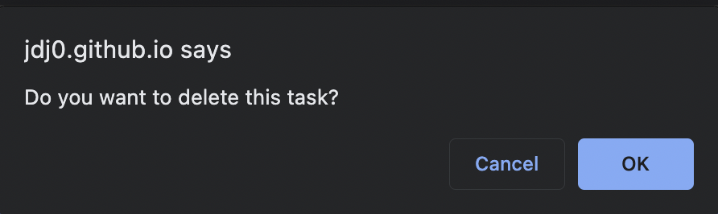

<h1 align="center">To-Do List</h1>

A simple digital to-do list that allows a user to input tasks then check them off as they are completed, or delete them if no longer relevant. 

View live site [here](https://jdj0.github.io/milestone2-todo/).

# UX

## User Story
- As a user of the application, I want to be able to input tasks that I want to get done that day. I want to be able to check off each task as I accomplish them. I want the option of deleting tasks that are no longer relevant.

## Design
- Design Choices
    - The web page is a simple application designed to be as uncluttered as possible in order to fade into the background when not in use. The application itself is narrowly built in order to encourage and allow the user to have their to-do list open as a split screen, minimising the screen estate that the application takes up. A minimalist approach has been taken to the colour scheme and design. 

- Colour Scheme
    - The colour scheme has been chosen to be easy on the eye with a dark grey background (#2b2929), a jet black body (#111111) and a strong blue (#4672fe) to provide detail and highlight certain features.

- Typography
    - Throughout the app ‘Inter’ was used with a backup of ‘sans-serif’. The only exception was the title of the app which was in 'Chakra Petch’, once again, with the backup of ‘sans-serif’. Both fonts were provided by Google fonts through a CDN.

- Wireframe 
    - Desktop
    
    - Mobile
    
# Features
- Interactive web application that allows the user to input and store tasks they want to get done.
- Fully responsive — optomised for phone, tablet, laptop and desktop. 

# Technologies Used
## Languages used
 - HTML5
 - CSS3
 - JavaScript ES6

 ## Frameworks, Libraries & Programmes used:
1.	Google Fonts
    - Fonts: ‘Inter’ and ‘Chakra Petch’.
2.	Font Awesome
    - Icons were used as check-mark and trash buttons.
3.	Git
    - Git was utilised for version control through ‘commit’ and ‘push’ commands through the terminal.
4.	Github
    - Github was used to store code ‘pushed’ from Gitpod.
5.	Balsamiq
    - Balsamiq was used to outline both the desktop and phone wireframes.

# Testing
The HTML, CSS and JavaScript were put through validators and passed through without errors.
- JSHint
    - Passed with no errors.
- HTML5 

- CSS3 

- Google lighthouse. 

## Testing User Stories
- "As a user of the application, I want to be able to input tasks that I want to get done that day. I want to be able to check off each task as I accomplish them. I want the option of deleting tasks that are no longer relevant."
    -  A user of the application is greeted with a clear, clutter free interface that is clearly titled as a to-do list. The input at the bottom of the application is auto-focussed and has placeholder text that asks the user to “Add tasks here”. The add icon next to the input changes colour when hovered over to let the user know it is a button to be clicked:\
    \
    Once the task is added to the list, the user is presented with intuitive icons that provide the functionality of completing or deleting the task:\
    \
     The application will alert the user if they try and add a task without adding text to the input:\
    \
     The user will see a confirmation message pop up when they try to delete a task:\
    \
    The input is limited to a max of 30 characters in order to preserve the formatting of the application. 

## Further Testing
- Browsers
    - Chrome: Displays and acts as intended. 
    - Safari: Displays and acts as intended.
    - Mozilla: Displays and acts as intended.
    - Opera: Displays and acts as intended.
- Devices
     - MacBook Pro 13inch: Displays and acts as intended.
     - iPhone 13 Pro: Displays and acts as intended.
     - iPad Pro: Displays and acts as intended.
    - OnePlus Nord: Displays and acts as intended.
     - Huawei Mateview display: Displays and acts as intended. 
 - Real World Testing
     - Friends and family members used the application to mentally 'offload' tasks that they wished to get done. This preliminery testing was successful, but did highlight an issue on mobile devices that used safari as a browser, where the search bar being at the bottom of the page covered part of the input. This bug has since been fixed and is documented below.

## Bug and Fixes
- Mobile safari browsers have the search bar at the bottom of the window. This caused part of the input to be covered.
    - Fix: changing the height of the application on mobile devices to "90vh".
- It was possible to input empty tasks to the task list.
    - Fix: Adding an “if” statement that alerts the user if they have tried adding an empty task to the task list.
- It was possible to type in a task so long that it would run off the task list div.
    - Fix: Added a limit of 30 characters to the task input.

# Next Steps
- Add a local storage feature so that the user can leave the webpage and return later to find the same tasks.
- Add features that enhance and even reward productivity.

# Deployment

## GitHub Pages
To deploy the site through GitHub pages:
1.	Log in to GitHub and go to the GitHub Repository.
2.	Click on settings (the gear icon).
3.	Scroll down to the GitHub Pages header and click on the ‘Check it out here!’ link.
4.	Under the Source header, from the dropdown menu choose ‘main’ then select folder '/ (root)'.
5.  Click Save.
6.	After the page refreshes, scroll down to the published website link found under the GitHub pages header.

## Forking the GitHub Repository
To create a copy of the project to experiment with changes in a safe way that will not affect the original site:
1.	Log into GitHub. Go to the GitHub Repository.
2.	Near the top of the Repository, click the “Fork” button in order to create a copy of the repository. 

## Making a Local Clone
1.	Log into GitHub go to the GitHub Repository.
2.	Click ‘Code’.
3.	To clone the repository using HTTPS, under "Clone with HTTPS", click the clipboard icon to copy the link. 
4.	Open Git Bash. 
5.	Change the current working directory to the location you want the cloned directory.
6.	Type ‘git clone’, add a space, then paste the URL that was copied earlier (step 3) and press enter. This should have created a clone.

For a detailed step-by-step guide with screenshots, click [here](https://docs.github.com/en/repositories/creating-and-managing-repositories/cloning-a-repository#cloning-a-repository-to-github-desktop).

# Credits
## Code
- StackOverflow:
The code for the date was taken from a post on stack overflow but was modified to a UK format. The source can be found [here](https://stackoverflow.com/questions/1531093/how-do-i-get-the-current-date-in-javascript).
## Content
- All content written by Joshua Jones (Developer).
- The  example Code Institute Read Me file, on which this Read Me file is based on.
## Media
- All images and wireframes in this read me were created by the developer. 
## Acknowledgments
- My Mentor, Precious Ijege, for his thoughtful and helpful feedback. 
- Tutor Support, for their invaluable support throughout the entire project, with a special shoutout to Alex!  